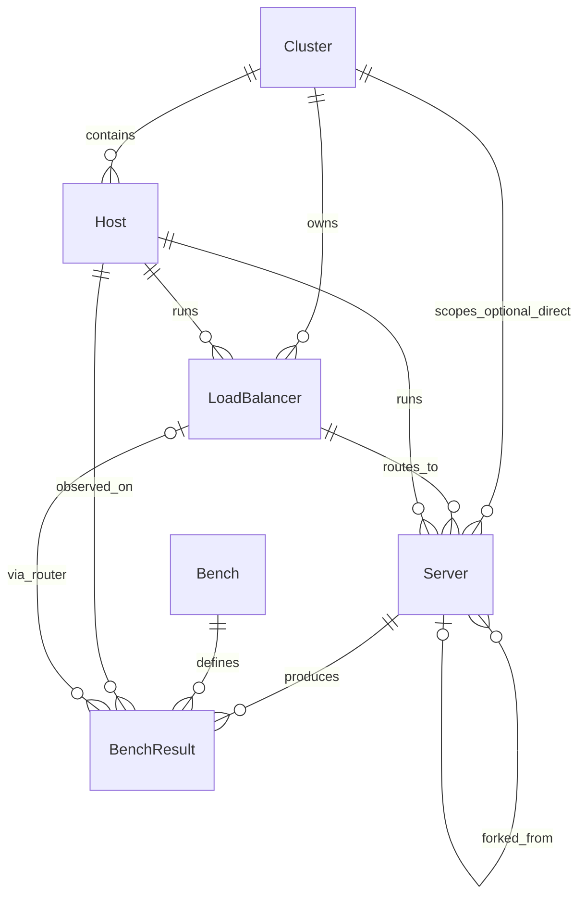
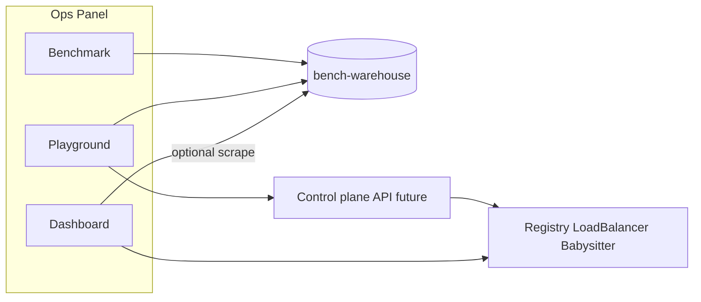

# Operations panel: entity model and module IA (proposal)

This document records a **proposal** for an InfiniOrchestrator **operations panel**: a website to manage production topology and benchmarks. It is **entity-first** — the six entities below are the contract; UI and control-plane APIs come later. **No panel, control-plane store, or new warehouse schema is implemented yet.**

Related:

- Discovery (later etcd): [`discovery-etcd.md`](discovery-etcd.md)
- Bench client / orchestrator / server split: monorepo `.cursor/rules/bench-warehouse-client-server.mdc`
- Historical metrics: `InfiniOrchestrator/BENCH_WAREHOUSE_REPO (data-only; harness in InfiniOrchestrator/harness/)` (or `BENCH_WAREHOUSE_REPO`; `raw/` → `warehouse/`, `bench-query`)

## Goals

- Make **Cluster, Host, LoadBalancer, Server, Bench, BenchResult** unambiguous and mappable to today’s runtime.
- Sketch three panel modules — **Benchmark**, **Playground**, **Dashboard** — only as consumers of those entities.
- Align with Dynamo for **structure and observability analogy** (LoadBalancer ≈ Dynamo Frontend), not as a product clone.

## Non-goals (this proposal)

- Implementing frontend, control-plane service, or DB migrations.
- Changing bench-warehouse TSV layout or inventing a parallel metric warehouse.
- Wireframe mockups beyond module responsibilities.
- etcd discovery implementation (see [`discovery-etcd.md`](discovery-etcd.md)).
- Dynamo Planner / SLA autoscaler UI (explicitly deferred; see gap notes below).

## Dynamo alignment

Dynamo is referenced for **layout and long-term discovery**, not as a runtime dependency (see repo [`README.md`](../../README.md)).

| Dynamo concept | InfiniOrchestrator analog |
|----------------|---------------------------|
| Frontend (OpenAI gateway + routing) | **LoadBalancer** (`infini-loadbalancer`, `ROUTER_URL`) |
| Worker / backend | **Server** (babysitter + inference / embeddings) |
| Discovery plane | HTTP registry today; etcd later |
| Grafana / Frontend `/metrics` | **Dashboard** live scrapes (not Grafana itself in v1) |
| Operator / DGDR deploy | Compose + babysitter TOML (Playground launch later) |

Dynamo’s public “panel” is largely **Prometheus + Grafana** (and Planner diagnostics). Our panel adds **historical Benchmark** (bench-warehouse) and a **Playground** (fork / custom bench registration) that Dynamo does not expose as a first-class admin UI.

### Gap vs Dynamo (summary)

| Area | Dynamo | This proposal |
|------|--------|-----------------|
| Live TTFT/ITL/GPU dashboards | Strong (Grafana, DCGM) | Dashboard module sketched; Prom/Grafana stack TBD |
| Planner / SLA autoscaling UI | Yes | Out of scope |
| Historical bench warehouse browser | Weak / none | **Benchmark** module (first-class) |
| Fork server from past run + custom bench registry | No | **Playground** module |
| Entity model | K8s / DGD-centric | Cluster → LoadBalancer → Server (+ optional direct) |

## Entity catalog

Six categories. Primary topology: **Cluster → LoadBalancer → Server**. Optional shortcut: **Cluster → Server** (`router_id` null). **Host** is placement (where LoadBalancer/Server processes run).

### Topology rules

1. **Cluster** owns zero or more **LoadBalancers** (typically one public OpenAI-compatible entrypoint per production cluster today).
2. **Primary path:** LoadBalancer discovers and load-balances to Servers (registry poll today; etcd later). Server has `router_id` set.
3. **Optional shortcut:** Cluster → Server without a LoadBalancer (`router_id` null). Used for direct worker targeting (bench `/metadata` + `/metrics`, single-server smoke, or clusters that omit router). Same `cluster_id` / `host_id`; no LB entrypoint.
4. Dual-host slave workers usually register into the master’s registry and appear as Servers behind the master’s LoadBalancer — same `cluster_id` / `router_id`. Direct-to-server remains valid when intentionally skipping router.

### Cluster

| Field | Notes |
|-------|--------|
| `cluster_id` | Stable id (e.g. deploy case slug or UUID). |
| `name` | Human label. |
| `env` | `production` \| `dev` (aligns with warehouse `deploy_tier` where applicable). |
| `registry_url` | Today’s HTTP registry on master (`REGISTRY_URL`). |
| `deploy_case` | Path/name under `deploy/cases/…`. |
| `discovery_prefix` | Optional; future etcd prefix (see discovery-etcd). |

**Maps to today:** one Compose project + shared registry/router URLs. No first-class Cluster table exists yet.

### Host

| Field | Notes |
|-------|--------|
| `host_id` | Stable id; often hostname / `HOST_ID` / advertise host. |
| `hostname` | DNS or node name. |
| `cluster_id` | Owning cluster. |
| `role` | `master` \| `slave` \| other. |
| `platform` / `arch` | e.g. `hpcc`, `aarch64` (warehouse partition dims). |
| `gpu_inventory` | Optional sketch: count, model, driver. |

**Maps to today:** `hostname` / `BABYSITTER_HOST` / `MASTER_ADVERTISE_HOST` / `SLAVE_ADVERTISE_HOST`; warehouse `host` columns in `data.tsv`.

### LoadBalancer

| Field | Notes |
|-------|--------|
| `router_id` | Stable id for this router process / endpoint. |
| `cluster_id` | Owning cluster. |
| `host_id` | Placement host (usually master). |
| `url` | Public listen URL (`ROUTER_URL`, e.g. `:8000` / `:8800`). |
| `lb_policy` | e.g. round-robin / weight (as implemented by `infini-loadbalancer`). |
| `healthy` | From `/health` or process liveness. |
| `models` | Aggregated model list from `/models` or `/services`. |
| `servers` | Ordered list of **Server** refs currently behind this router (`server_id` / `service_name`, healthy flag, weight). Inverse of Server.`router_id`; empty when no backends registered. |
| `worktree` | Source identity for the **LoadBalancer** binary/process itself: path (or label) of the checkout / image build context plus **git SHAs** of repos that built it (e.g. InfiniOrchestrator / vendored `rust/`). Distinct from per-backend Server.`worktree`; backends’ SHAs still surface via `metadata` / `servers`. |
| `metadata` | Aggregated view of backends’ Server.`metadata` keyed by `server_id` / `service_name` (e.g. `cache_type`, build_info, runtime_env, frontend). LoadBalancer-local fields (LB annotations) may sit alongside; refreshed when `servers` is rediscovered. |
| `stats_snapshot` | Optional projection of `/status` / `/stats` (request/error counters). |

**Maps to today:** `infini-loadbalancer` binary; Dynamo Frontend analog. `servers` projects router `/services` (and registry poll) into `ServiceInstance` rows; `metadata` rolls up each instance’s `metadata` map — no LoadBalancer entity store yet, only process + env.

### Server

| Field | Notes |
|-------|--------|
| `server_id` | UUID from inference `GET /metadata` (canonical for warehouse rows). |
| `service_name` | Registry / babysitter logical name. |
| `cluster_id` | Required. |
| `host_id` | Required (placement). |
| `router_id` | **Optional.** Null = Cluster→Server shortcut (direct attach). |
| `url` | Inference listen URL. |
| `babysitter_url` | Typically `port+1` health/info. |
| `status` | e.g. `starting` \| `healthy` \| `unhealthy` \| `stopped` \| `historical`. |
| `model` | Model slug(s). |
| `config_snapshot` | Immutable copy of launch args / TOML / env for Playground fork. |
| `image_tag` / SHAs | Build identity (warehouse base columns). |
| `worktree` | Source identity for the code this Server runs: path (or label) of the checkout / build context plus **git SHAs** of repos in use (e.g. InfiniLM, InfiniCore, InfiniOrchestrator, optional vLLM). Captured at launch from `GET /metadata` build_info / env probes; immutable on historical Server for Playground fork. |
| `forked_from_server_id` | Optional lineage when launched from a past Server. |
| `metadata` | Opaque key/value map (JSON). Carries registry/babysitter registration fields (e.g. `cache_type`) plus projection of inference `GET /metadata` (`server_id`, build_info, runtime_env, frontend, …). |

**Maps to today:** registry `ServiceInfo.metadata`, router `ServiceInstance.metadata`, babysitter TOML `[metadata]`, and inference `GET /metadata` / `/v1/metadata`.

Live instances mirror registry heartbeats. **Historical** servers are immutable config snapshots used only for Playground “fork”.

### Bench

| Field | Notes |
|-------|--------|
| `bench_id` | Suite+step slug, e.g. `random-fixed-length__Qwen3-32B`, `unexpected_behavior__cancel_mid_decode`. |
| `bench` | Suite prefix (`random-fixed-length`, `ceval`, `unexpected_behavior`, …). |
| `bench_family` | `resilience` \| `correctness` \| `latency` \| `accuracy` (warehouse). |
| `default_params` | e.g. `MAX_CONCURRENCY`, `NUM_PROMPTS`. |
| `runner` | Entrypoint under `bench-warehouse/harness/` (or custom). |
| `source` | `builtin` \| `custom` (Playground registration). |

**Maps to today:** harness recipes + `manifest.json` / `bench_harness.registry` — not a typed registry API yet.

### BenchResult

| Field | Notes |
|-------|--------|
| Identity | Prefer `(server_id, started_at)` (warehouse dedupe key) or emit-row key. |
| `bench_id` | FK to Bench. |
| `server_id` | FK to Server. |
| `cluster_id` | Denormalized for filters. |
| `host_id` | Observed host. |
| `router_id` | **Traffic path discriminator.** Set to the LoadBalancer used for bench `/v1/*` traffic (**via LoadBalancer**). Null means bench ran **direct against Server** (Cluster→Server shortcut; `BENCH_TARGET_URL` only). `server_id` still records which backend was under test / scraped for `/metadata`+`/metrics` even when `router_id` is set. |
| `model` | Model slug under test for this run (warehouse partition key; aligns with Server.`model` / harness `MODEL`). First-class filter for Benchmark views. |
| `bench_args` | **Concrete args for this run** (not Bench defaults). Key/value map of harness knobs actually used: e.g. `MAX_CONCURRENCY`, `NUM_PROMPTS`, `input_len`/`output_len`, ceval `limit`, drain flags, `BENCH_TARGET_URL` / `ROUTER_URL`, and any Playground overrides. Required for reproducible compare/fork. |
| `status` | Run outcome (`pass` / `fail` / …). |
| `metrics` | Client columns (`ttft_*`, `ceval_em`, …) + `srv_*` from Prometheus scrape. |
| Partition dims | `frontend`, `platform`, `arch`, `gpu_model`, `gpu_driver`, `date` (plus `model` above). |

**Maps to today:** one `raw/.../data.tsv` row → warehouse `facts` / rollups; `bench_args` projects emit-time env/CLI columns (and suite artifacts) rather than Bench.`default_params`. Live Dashboard scrapes are **not** BenchResults unless a harness emit persists them.

## Mapping to current stack

| Layer | Path / API | Entities touched |
|-------|------------|------------------|
| Deploy case | `deploy/cases/<case>/docker-compose.yml` | Cluster, Host |
| Registry | `GET/POST /services`, heartbeats | Server (live) |
| LoadBalancer | `/health`, `/status`, `/stats`, `/services`, `/models`, proxy `/v1/*` | LoadBalancer, Server (routed) |
| Babysitter | TOML + process manager; `/health` on port+1 | Server |
| Inference | `GET /metadata`, `GET /metrics`, `/v1/*` | Server identity + Dashboard metrics |
| Orchestrator scripts | `scripts/run_*_full_bench.sh`, case `bench/` | Playground lifecycle (future) |
| Harness | `bench-warehouse/harness/run_bench_client.sh` | Bench, BenchResult emit |
| Warehouse | `raw/`, `warehouse/`, `bench-query` | BenchResult history |

**Projection principle:** prefer reading existing registry/router/metadata/warehouse into these entities. Gaps today: no Cluster / Host / LoadBalancer / Bench tables; LoadBalancer is only an HTTP process + `ROUTER_URL`.

## Module → entity matrix

| Module | Creates | Reads | Updates |
|--------|---------|-------|---------|
| **Benchmark** | — | BenchResult, Bench, Server, Host, Cluster, LoadBalancer (filter) | — |
| **Playground** | Server (fresh/fork), Bench (custom), BenchResult (via harness) | Cluster, Host, LoadBalancer?, Server history, Bench | Server status (start/stop) |
| **Dashboard** | — | LoadBalancer, Server (live), Host, Cluster | — (live scrape only) |

### 1. Benchmark (historical)

- Read-only explorer over warehouse rollups (`facts`, `report_by_server`, `summary` via `bench-query`).
- Filters: Cluster / LoadBalancer / Host / Server / Bench / date / model.
- Views: trends by `bench_id`, compare servers, drill to `server_id` and optional `router_id`.

### 2. Playground (launch + run)

- **Fresh Server:** place on Host in Cluster; attach to LoadBalancer **or** leave `router_id` null (shortcut).
- **Fork from history:** copy `config_snapshot` from a historical Server / BenchResult; set `forked_from_server_id`.
- **Kick off Bench:** harness as HTTP client only — orchestrator owns docker/GPU/lifecycle. Traffic via `ROUTER_URL` and/or direct `BENCH_TARGET_URL` / `INFERENCE_SERVER_BASE_URL` for `/metadata` + `/metrics`.
- **Register custom:** Server launch templates and Bench recipes (`source=custom`).

### 3. Dashboard (live production)

- Cluster → LoadBalancer → Server drill-down **and** Cluster → Server (shortcut) listing.
- Sources: router `/status`/`/stats`/`/services` (if any), registry `/services`, worker `/metrics` + `/metadata`.
- Views: health, TTFT/ITL/engine gauges, router request/error counters when a LoadBalancer is present.

## Playground flows (sketch)

### Fresh launch (via LoadBalancer)

1. Select Cluster, Host, optional LoadBalancer.
2. Choose Server template (TOML / image / model).
3. Control plane starts babysitter+backend; registry registration yields live Server with `router_id` set.
4. Optionally start Bench with `ROUTER_URL` for `/v1/*` and direct base URL for metrics.

### Fresh launch (Cluster → Server shortcut)

1. Select Cluster, Host; omit LoadBalancer (`router_id` null).
2. Start Server; Bench uses `BENCH_TARGET_URL` only.
3. BenchResult stores `server_id`, no `router_id`.

### Fork from history

1. Pick historical Server or BenchResult → load `config_snapshot`.
2. Choose placement (Host / LoadBalancer or direct).
3. Launch as new `server_id` with `forked_from_server_id`.

### Custom registration

- **Custom Server template:** name, command/TOML, default env, resource hints.
- **Custom Bench:** `bench_id`, runner entrypoint, param schema, family.

## Data ownership

| Store | Owns | Notes |
|-------|------|--------|
| **Control-plane store (future)** | Cluster, Host, LoadBalancer registry, Server templates, custom Benches, live desired state | Persistence choice TBD (DB vs config files). |
| **bench-warehouse** | BenchResult history | Git-backed TSV; query via CLI today. Panel projects, does not rewrite schema. |
| **Live scrape** | Dashboard gauges | Ephemeral; not BenchResult unless harness emits. |

## Phasing

1. **Doc (now)** — this entity + module IA.
2. **Read-only Benchmark API** — wrap `bench-query` / warehouse partitions behind HTTP for the Benchmark module.
3. **Dashboard** — project registry + router + worker metrics into Cluster/LoadBalancer/Server views.
4. **Playground mutations** — launch/fork/stop Server; run Bench; custom registration (orchestrator boundary enforced).

## Open questions (deferred)

- Persistence for control-plane entities (SQL, etcd, file, or case TOML as source of truth).
- Authn/authz for production Playground mutations.
- Multi-router per cluster (active-active vs active-standby).
- When to prefer direct Server vs via-LoadBalancer for a given Bench (correctness vs production path fidelity).
- Whether Dashboard v1 embeds Grafana or scrapes `/metrics` itself.
- Whether Registry becomes a first-class entity or stays an implementation detail of Cluster discovery.

## Refactor notes

- Case browser: `playground/{Standalone,Distribution}` filtered by model / hw_abbr / be_abbr
- Discovery: etcd
- Warehouse: `raw/<date>`, `compact/<model_id>` cross-HW; no best-on
- Full panel UI rebuild remains deferred
